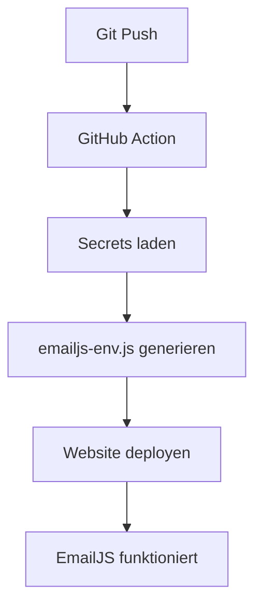

# GitHub Secrets Setup für EmailJS

## 🔐 Sichere Konfiguration über GitHub

Ihre EmailJS Keys werden jetzt **sicher über GitHub Secrets** verwaltet und **niemals im Code** gespeichert!

## 🚀 Setup in 3 Schritten

### Schritt 1: GitHub Secrets konfigurieren

1. **Öffnen Sie Ihr GitHub Repository:** https://github.com/blacklodgeswiss/blacklodgeswiss.github.io

2. **Gehen Sie zu Settings:**
   - Klicken Sie auf **"Settings"** (oben rechts im Repository)
   
3. **Secrets konfigurieren:**
   - Links auf **"Secrets and variables"** → **"Actions"**
   - Klicken Sie **"New repository secret"**

4. **Fügen Sie diese 3 Secrets hinzu:**

   **Secret 1: EMAILJS_PUBLIC_KEY**
   ```
   Name: EMAILJS_PUBLIC_KEY
   Value: [Ihr EmailJS Public Key von Dashboard - holen Sie das aus EmailJS Dashboard → Integration]
   ```

   **Secret 2: EMAILJS_SERVICE_ID**  
   ```
   Name: EMAILJS_SERVICE_ID
   Value: service_6qyyzfp
   ```

   **Secret 3: EMAILJS_TEMPLATE_ID**
   ```
   Name: EMAILJS_TEMPLATE_ID  
   Value: contact_blacklodge  (oder wie Sie das Template genannt haben)
   ```

   > **💡 Wichtig:** Die Service ID `service_6qyyzfp` haben Sie bereits! Sie brauchen nur noch den Public Key und Template ID.

### Schritt 2: EmailJS Template erstellen

Da Sie bereits `service_6qyyzfp` haben, brauchen Sie nur noch:

1. **EmailJS Dashboard öffnen:** https://dashboard.emailjs.com/
2. **"Email Templates"** → **"Create New Template"**
3. **Template ID eingeben:** `contact_blacklodge` (merken!)
4. **Template konfigurieren:** (siehe `EMAILJS_SETUP.md`)

### Schritt 3: Secrets in GitHub eintragen

**EMAILJS_PUBLIC_KEY** finden Sie hier:
- EmailJS Dashboard → Integration → Public Key

**EMAILJS_TEMPLATE_ID** ist:
- `contact_blacklodge` (oder wie Sie es genannt haben)

## 🔄 Automatische Deployment

Nach dem Setup:

1. **GitHub Action wird ausgeführt** bei jedem `git push`
2. **Secrets werden sicher injiziert** in die Website  
3. **Keine Keys im Code** → sicherer
4. **Website automatisch deployed** mit neuer Konfiguration

## 📂 Wie es funktioniert



## ✅ Vorteile der neuen Methode

| Aspekt | Vorher | Jetzt |
|--------|--------|-------|
| **Sicherheit** | ❌ Keys im Code | ✅ GitHub Secrets |
| **Versionskontrolle** | ❌ Keys in Git | ✅ Keine Keys in Git |
| **Team-Sharing** | ❌ Keys weitergeben | ✅ Team-Zugriff |
| **Key-Rotation** | ❌ Code ändern | ✅ Secret ändern |

## 🧪 Entwicklung & Testing

**Für lokale Entwicklung** können Sie Keys temporär setzen:

```javascript
// In Browser Console für Testing:
localStorage.setItem('emailjs_public_key', 'IHR_KEY');
localStorage.setItem('emailjs_service_id', 'service_6qyyzfp');  
localStorage.setItem('emailjs_template_id', 'contact_blacklodge');

// Page neu laden
location.reload();
```

## 🔍 Debugging

**Kontaktformular öffnen** und **F12 Console** checken:
```
📧 EmailJS Config Status: {
  publicKey: "✅ Loaded",
  serviceId: "✅ Loaded", 
  templateId: "✅ Loaded"
}
```

## 🆘 Troubleshooting

**Formular funktioniert nicht?**

1. **Secrets prüfen:** GitHub → Settings → Secrets
2. **Template prüfen:** EmailJS Dashboard  
3. **Console checken:** F12 → Console Tab
4. **GitHub Action prüfen:** Actions Tab im Repository

**GitHub Action läuft nicht?**
- Repository → Actions → "Enable Actions" 
- Pages muss aktiviert sein: Settings → Pages → Source: GitHub Actions

## 🎯 Nächste Schritte

1. ✅ **GitHub Secrets einrichten** (3 Secrets)
2. ✅ **EmailJS Template erstellen** (`contact_blacklodge`)  
3. ✅ **Git push machen** → automatisches Deployment
4. ✅ **Kontaktformular testen**

**Viel sicherer und professioneller! 🔐**